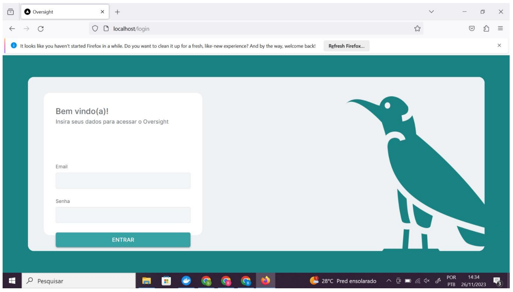

## ATAM (Architecture Tradeoff Analysis Method)

 

### RNF001 - O sistema deverá ter executabilidade no chrome e firefox

| | |
|--- |--- |
| **Atributo de qualidade** | Compatibilidade |
| **Requisito de qualidade** | Possuir executabilidade no chrome e firefox |
|**Preocupação** | O sistema deve funcionar corretamente, sem problemas de compatibilidade, tanto no Chrome como no Firefox |
|**Cenários** | O usuário poderá executar o sistema no Chrome ou Firefox e o mesmo deve se comportar corretamente, ou seja, as funcionalidades devem estar disponíveis e usuais em ambos os navegadores |
|**Ambiente** | Sistema em operação regular |
|**Estímulo** | Execução do sistema |
|**Mecanismo** | Adição de tags do CSS3 que proveem a compatibilidade cross-browser |
|**Medida de Resposta** | O sistema deve abrir nos navegadores sem erros de compatibilidade |
| | |

 Imagem 1: Aplicativo executando no Firefox

 Imagem 2: Aplicativo executado no Chrome

 

### RNF002 - O sistema terá sistema de criptografia de autenticação de usuário JWT (sistema-usuário)

| | |
|--- |--- |
| **Atributo de qualidade** | Segurança |
| **Requisito de qualidade** | Possuir autenticação por tokens JWT |
|**Preocupação** | O sistema deve realizar requisições constantes ao backend sem precisar re-autenticar o usuário e sua senha o tempo todo, mas manter segurança evitando autorização eterna |
|**Cenários** | O usuário precisa realizar várias requisições ao atuar na página de orçamentos e não pode ser interrompido durante seu processo |
|**Ambiente** | Sistema em operação regular |
|**Estímulo** | Realizar login no sistema |
|**Mecanismo** | Gateway de Autenticação que gera um token JWT explicável, usado para realizar requisições à API Rest |
|**Medida de Resposta** | O usuário precisa ter suas credenciais de acesso validadas e, caso as tenha, sua requisição deve prosseguir normalmente |
| | |

 Imagem 3: Login realizado pelo Postman, recebendo o token JWT como “session-token

 

### RNF003 - O sistema terá autenticação AES relativa às interações internas do sistema (sistema-sistema)

| | |
|--- |--- |
| **Atributo de qualidade** | Autenticação |
| **Requisito de qualidade** | Possuir autenticação AES |
|**Preocupação** | O sistema deve ter autenticação AES para às interações internas do sistema (sistema-sistema) |
|**Cenários** | Todas as comunicações entre front e back passam primeiro pelo gateway de autenticação, onde ele redireciona as chamadas para as devidas APIs responsáveis, as quais autenticam a validade da requisição através de uma senha AES.|
|**Ambiente** | Sistema em operação regular |
|**Estímulo** | Realizar login no sistema / atuar dentro do sistema |
|**Mecanismo** | Segurança de dados através dos micro-serviços |
|**Medida de Resposta** | Possuindo um login válido, não devem haver interrupções na operação do usuário, mantendo sua segurança no máximo |
| | |

 
**Imagem 4: Log da aplicação.** A imagem refere-se a um log da aplicação demonstrando o recebimento do token de acesso e validação do mesmo pela API.