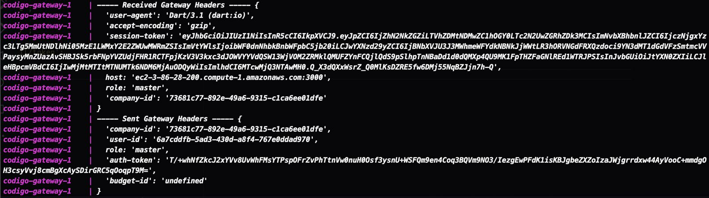

# Oversight

**Bruno Gomes Ferreira, bgferreira@sga.pucminas.br**

**João Pedro Mairinque de Azevedo, jpmairinque@gmail.com**

**Matheus Machado de Oliveira Andrade, matheus.andrade@sga.pucminas.br**

**Matheus Vieira dos Santos, mat.vsantos@outlook.com**

**Samara Martins Ferreira, mferreira.samara@gmail.com**

---

Professores:

**Aline Norberta de Brito**

**Cleiton Silva Tavares**

---

_Curso de Engenharia de Software, Unidade Praça da Liberdade_

_Instituto de Informática e Ciências Exatas – Pontifícia Universidade de Minas Gerais (PUC MINAS), Belo Horizonte – MG – Brasil_

---

**Resumo:** O projeto Oversight é uma solução voltada para o campo de gestão de orçamentos, projetado para simplificar e aprimorar o processo de gerenciamento de recursos financeiros e de serviços. O software conta com versão Web e Mobile e permite aos usuários cadastrar produtos e serviços, agilizando o processo de elaboração de orçamentos.

Para promover uma maior velocidade na comunicação com os clientes, o Oversight incorpora uma funcionalidade de mensageria que permite o envio de orçamentos por e-mail diretamente ao cliente, para a aprovação ou não do orçamento gerado.

---

## Histórico de Revisões

| **Data**       | **Autor**      | **Descrição**                                                     | **Versão** |
| -------------- | -------------- | ----------------------------------------------------------------- | ---------- |
| **05/09/2023** | Samara Martins | Alteração na sessão 01 - preenchimento dos tópicos 1.1, 1.2 e 1.3 | 1.0        |
| **12/12/2023** | Samara Martins | Alteração pontuais no documento                                   | 1.1        |
|                |                |                                                                   |            |

## SUMÁRIO

1. [Apresentação](#apresentacao "Apresentação")  
   1.1. Problema  
   1.2. Objetivos do trabalho  
   1.3. Definições e Abreviaturas  

2. [Requisitos](#requisitos "Requisitos")  
   ' 2.1. Requisitos Funcionais  
   2.2. Requisitos Não-Funcionais  
   2.3. Restrições Arquiteturais  
   2.4. Mecanismos Arquiteturais  

3. [Modelagem](#modelagem "Modelagem e projeto arquitetural")  
   3.1. Visão de Negócio  
   3.2. Visão Lógica  
   3.3. Modelo de dados (opcional)  

4. [Avaliação](#avaliacao "Avaliação da Arquitetura")  
   4.1. Cenários  
   4.2. Avaliação  

5. [Referências](#referencias "REFERÊNCIAS") 

6. [Apêndices](#apendices "APÊNDICES") 

# 1. Apresentação

No cenário atual dos negócios, a agilidade e a eficiência são cruciais para o sucesso de qualquer empresa. A gestão de orçamentos, bem como a comunicação efetiva com os clientes, são elementos fundamentais nesse contexto. Este projeto de software foi concebido para atender a essas necessidades específicas, permitindo que os usuários criem orçamentos de maneira simplificada e, em seguida, os enviem diretamente aos clientes por e-mail.

## 1.1. Problema

No cenário de mercado atual, grande parte das empresas que fornecem serviços e/ou produtos possuem a necessidade de gerir um orçamento para seus clientes antes do ato da compra. Porém, uma boa parte dessas empresas ainda realizam essa tarefa de forma manual ou não conseguem adquirir um software adequado para isso, tendo em vista os altos custos dessas aplicações, uma vez que, costumam se tratar de softwares mais completos e genéricos, voltados para toda a gestão empresarial (ERP¹).

## 1.2. Objetivos do trabalho

O objetivo geral deste trabalho é apresentar uma descrição completa e detalhada do projeto arquitetural da aplicação que será desenvolvida. A arquitetura da aplicação desempenha um papel crítico na garantia da funcionalidade, escalabilidade, segurança e eficiência do software. Portanto, o principal propósito deste trabalho é proporcionar uma visão abrangente da arquitetura da aplicação, destacando seus principais componentes e como eles interagem para atender aos requisitos do sistema.

## 1.3. Definições e Abreviaturas

1. ERP - (Enterprise Resource Planning) é um software empresarial que integra processos e melhora a eficiência organizacional.
2. RF - (Requisito Funcional) requisitos que o sistema de software ou o componente de sistema deve ser capaz de executar.
3. RNF - (Requisito Não Funcional) restrições nos serviços e nas funções oferecidas pelo sistema.
4. UC - (Use Case) refere-se ao diagrama de caso de uso.

# 2. Requisitos

_Esta seção descreve os requisitos comtemplados nesta descrição arquitetural, divididos em dois grupos: funcionais e não funcionais._

## 2.1. Requisitos Funcionais

| **ID** | **Descrição**                                                                   | **Prioridade** |
| ------ | ------------------------------------------------------------------------------- | -------------- |
| RF001  | O administrador pode gerenciar o usuário no sistema                             | Alta           |
| RF002  | O usuário pode fazer login no sistema                                           | Alta           |
| RF003  | O usuário pode gerenciar ativos                                                 | Alta           |
| RF004  | O usuário pode gerenciar cliente                                                | Alta           |
| RF005  | O usuário pode gerenciar orçamento                                              | Alta           |
| RF006  | O usuário pode acionar o envio do orçamento para cliente por email              | Alta           |
| RF007  | O usuário Master pode cadastrar empresa                                         | Média          |
| RF008  | O usuário Master pode cadastrar um administrador                                | Média          |
| RF009  | O usuário pode emitir PDF do orçamento                                          | Baixa          |
| RF010  | O usuário pode inserir percentual de lucro relativo ao orçamento                | Média          |
| RF011  | O usuário pode buscar cliente por: nome, email, endereço ou data                | Média          |
| RF012  | O sistema de reconhecer a recusa ou aceitação do orçamento do cliente via email | Alta           |
| RF013  | O usuário pode buscar orçamento pelo ID ou nome                                 | Média          |
| RF014  | O usuário pode visualizar listas de orçamentos divididas por status             | Baixa          |
| RF015  | O cliente pode modificar o status do orçamento a partir da aceitação do email   | Média          |
| RF016  | O usuário pode visualizar a quantidade de orçamentos em cada status             | Baixa          |

## 2.2. Requisitos Não-Funcionais

_Enumere os requisitos não-funcionais previstos para a sua aplicação. Entre os requisitos não funcionais, inclua todos os requisitos que julgar importante do ponto de vista arquitetural ou seja os requisitos que terão impacto na definição da arquitetura. Os requisitos devem ser descritos de forma completa e preferencialmente quantitativa._

| **ID** | **Descrição**                                                                                |
| ------ | -------------------------------------------------------------------------------------------- |
| RNF001 | O sistema deverá ter executabilidade no chrome e firefox                                     |
| RNF002 | O sistema terá sistema de criptografia de autenticação de usuário JWT (sistema-usuário)      |
| RNF003 | O sistema terá autenticação AES relativa às interações internas do sistema (sistema-sistema) |

## 2.3. Restrições Arquiteturais

- O software deverá ser desenvolvido em TypeScript e Dart;
- A comunicação da API deve seguir o padrão RESTful no backend;
- A implementação do microserviço de mensageria será via RabbitMQ;
- A O front-end será desenvolvido utilizando Flutter e Next.js;
- O banco de dados será implementado pelo PostgreSQL.

## 2.4. Mecanismos Arquiteturais

| **Análise**       | **Design**         | **Implementação**   |
| ----------------- | ------------------ | ------------------- |
| Persistência      | ORM                | PostgresSQL         |
| Front end Mobile  | Clean Architecture | Flutter             |
| Front end Web     | Strategy           | Next.js             |
| Back end          | Micro serviços     | Node.ts             |
| Integração        | N/A                | TCP                 |
| Log do sistema    | N/A                | N/A                 |
| Teste de Software | unitário           | Jest                |
| Deploy            | Distribuído        | Docker + Kubernetes |

# 3. Modelagem e projeto arquitetural

A solução será desenvolvida atravez do padrão arquitetural de micro serviços, no qual o cliente interage sempre com o serviço de autenticação primeiro e, após ser autenticado, é redirecionado para o serviço REST que detém as informações relacionadas à requisição realizada. O serviço de mensageria entra na recepção de aprovação ou reprovação dos orçamentos, no qual o email enviado é o `producer` que envia a resposta para a fila, da qual o `consumer` atualiza o estado do orçamento.

**Figura 1 - Visão Geral da Solução.** A imagem exibe a aquitetura geral do sistema, demonstrando a integração com serviços na nuvem através da AWS.

## 3.1. Visão de Negócio (Funcionalidades)

1. O sistema deve separar os usuários em três níveis de permissão (basic, admin e master)
2. O sistema deve permitir gerenciamento de `companies` (empresas)
3. O sistema deve permitir gerenciamento de `users` (usuários)
4. O sistema deve permitir gerenciamento de `customers` (clientes)
5. O sistema deve permitir gerenciamento de `addresses` (endereços)
6. O sistema deve permitir gerenciamento de `services` (serviços e materiais)
7. O sistema deve permitir gerenciamento de `budgets` (orçamentos)
8. O sistema deve permitir gerenciamento de `budgetServices` (serviços do orçamento)
9. O sistema deve solicitar aprovação do usuário por email
10. O sistema deve processar aprovações/reprovações consumindo uma fila no RabbitMQ

### Descrição resumida dos Casos de Uso / Histórias de Usuário

### 3.1.1 Casos de Uso

**Figura 2 - Diagrama de Caso de Uso.** A imagem exibe o diagrama de caso de uso do sistema. São representados três atores de forma hierárquica, onde, o usuário "Master" possui permissão para acessar e utilizar todas as funcionalidades do sistema.

### 3.1.2 Histórias de Usuário

- UC01 - Como usuário do Oversight, quero poder fazer login no sistema, porque quero poder utilizar as funcionalidade do sistema

- UC02 - Como usuário do Oversight, quero gerenciar clientes, porque poderei direcionar para qual cliente o orçamento será feito

- UC03 - Como usuário do Oversight, quero gerenciar orçamentos, porque poderei orçar o projeto do cliente baseado em seus ativos

- US04 - Como usuário do Oversight, quero poder gerenciar ativos, porque minha empresa necessitará desse cadastro para gerar um orçamento

- UC05 - Como usuário do Oversight, quero poder emitir PDF do orçamento gerado, porque desejo usar o PDF gerado em outras mídias.

- UC06 - Como usuário do Oversight, quero poder visualizar a quantidade de orçamentos, porque poderei ter uma métrica de quantos orçamentos foram abertos

- UC07 - Como usuário do Oversight, quero poder visualizar a lista de orçamentos, porque poderei ter uma noção visual sobre os orçamentos que estão abertos

- UC08 - Como usuário do Oversight, desejo inserir o percentual de l- ucro relativo ao orçamento, porque poderei ter uma métrica se estarei l- ucrando ou não ao comparar o que foi orçado inicialmente com a exercício do projeto

- UC09- Como usuário do Oversight quero poder acionar o envio do orçamento para cliente por e-mail, porque desejo que os clientes possam validar o orçamento gerado, para prosseguir ou não com o projeto

- UC10 - Como usuário do Oversight desejo poder visualizar o status do orçamento, ou seja: em andamento, recusa ou aceitação. Porque quero saber se o cliente deseja prosseguir com o projeto ou se o orçamento deve ser revisado

- UC11 - Como administrador do Oversight, quero poder gerenciar usuários no sistema. Porque poderei ter um controle dos usuários que terão acesso ao sistema.

- UC12 - Como usuário Master, quero poder cadastrar empresa para o uso do Oversight, porque quero ter um controle de quais empresas terão acesso ao aplicativo

- UC13 - Como usuário Master, quero cadastrar um administrador do sistema, pois esse usuário é um funcionário da empresa que terá um controle maior de os demais, ele poderá fazer a gestão dos outros funcionários que utilizarão o sistema

## 3.2. Visão Lógica

### Diagrama de Classes

**Figura 3 – Diagrama de classes.** O diagrama de classes representa uma visão de domínio do sistema, ou seja, foram apresentadas através dele as classes mais significativas da aplicação, bem como seus atributos e métodos.

### Diagrama de componentes

**Figura 4 – Diagrama de Componentes.** A imagem representa a comunicação entre os componentes do sistema, sendo eles: Browser, Server e Database.

## 3.3. Modelo de dados

 ")

**Figura 5 – Diagrama de Entidade Relacionamento (ER).** Representação de entidades e atributos utilizados na base de dados da aplicação, bem como o relacionamento entre eles.

# 4. Avaliação da Arquitetura

Esta seção descreve a avaliação da arquitetura apresentada, baseada no método ATAM.

## 4.1. Cenários

**Cenário 1 (RNF001) - Compatibilidade:** o sistema web deve possuir compatibilidade com os navegadores Chrome e Firefox. Ao executar o sistema em qualquer um desses navegadores, erros de compatibilidade não podem ser apresentados.

**Cenário 2 (RNF002) - Segurança:** o usuário precisa realizar várias requisições ao atuar na página de orçamentos e não pode ser interrompido durante seu processo.

**Cenário 3 (RNF003) - Autenticação:** após as comunicações entre front e back-end passarem pelo gateway de autenticação e o mesmo redirecionar as chamadas para as devidas APIs responsáveis, as APIs devem autenticar a validade da requisição através de uma senha AES.

## 4.2. Avaliação

### Cenário 1:

|                            |                                                                                                                                                                                         |
| -------------------------- | --------------------------------------------------------------------------------------------------------------------------------------------------------------------------------------- |
| **Atributo de qualidade**  | Compatibilidade                                                                                                                                                                         |
| **Requisito de qualidade** | Possuir executabilidade no chrome e firefox                                                                                                                                             |
| **Preocupação**            | O sistema deve funcionar corretamente, sem problemas de compatibilidade, tanto no Chrome como no Firefox                                                                                |
| **Cenários**               | O usuário poderá executar o sistema no Chrome ou Firefox e o mesmo deve se comportar corretamente, ou seja, as funcionalidades devem estar disponíveis e usuais em ambos os navegadores |
| **Ambiente**               | Sistema em operação regular                                                                                                                                                             |
| **Estímulo**               | Execução do sistema                                                                                                                                                                     |
| **Mecanismo**              | Adição de tags do CSS3 que proveem a compatibilidade cross-browser                                                                                                                      |
| **Medida de Resposta**     | O sistema deve abrir nos navegadores sem erros de compatibilidade                                                                                                                       |
|                            |                                                                                                                                                                                         |

 

### Cenário 2:

|                            |                                                                                                                                                                           |
| -------------------------- | ------------------------------------------------------------------------------------------------------------------------------------------------------------------------- |
| **Atributo de qualidade**  | Segurança                                                                                                                                                                 |
| **Requisito de qualidade** | Possuir autenticação por tokens JWT                                                                                                                                       |
| **Preocupação**            | O sistema deve realizar requisições constantes ao backend sem precisar re-autenticar o usuário e sua senha o tempo todo, mas manter segurança evitando autorização eterna |
| **Cenários**               | O usuário precisa realizar várias requisições ao atuar na página de orçamentos e não pode ser interrompido durante seu processo                                           |
| **Ambiente**               | Sistema em operação regular                                                                                                                                               |
| **Estímulo**               | Realizar login no sistema                                                                                                                                                 |
| **Mecanismo**              | Gateway de Autenticação que gera um token JWT explicável, usado para realizar requisições à API Rest                                                                      |
| **Medida de Resposta**     | O usuário precisa ter suas credenciais de acesso validadas e, caso as tenha, sua requisição deve prosseguir normalmente                                                   |
|                            |                                                                                                                                                                           |

 

### Cenário 3:

|                            |                                                                                                                                                                                                                                   |
| -------------------------- | --------------------------------------------------------------------------------------------------------------------------------------------------------------------------------------------------------------------------------- |
| **Atributo de qualidade**  | Autenticação                                                                                                                                                                                                                      |
| **Requisito de qualidade** | Possuir autenticação AES                                                                                                                                                                                                          |
| **Preocupação**            | O sistema deve ter autenticação AES para às interações internas do sistema (sistema-sistema)                                                                                                                                      |
| **Cenários**               | Todas as comunicações entre front e back passam primeiro pelo gateway de autenticação, onde ele redireciona as chamadas para as devidas APIs responsáveis, as quais autenticam a validade da requisição através de uma senha AES. |
| **Ambiente**               | Sistema em operação regular                                                                                                                                                                                                       |
| **Estímulo**               | Realizar login no sistema / atuar dentro do sistema                                                                                                                                                                               |
| **Mecanismo**              | Segurança de dados através dos micro-serviços                                                                                                                                                                                     |
| **Medida de Resposta**     | Possuindo um login válido, não devem haver interrupções na operação do usuário, mantendo sua segurança no máximo                                                                                                                  |
|                            |                                                                                                                                                                                                                                   |

 

**Considerações sobre a arquitetura:**

| **Riscos:**                  | Não existe |
| ---------------------------- | ---------- |
| **Pontos de Sensibilidade:** | Não existe |
| _ **Tradeoff** _ **:**       | Não existe |

## Evidências dos testes realizados

Abaixo serão apresentadas as imagens que comprovam a realização dos testes nos cenários descritos acima.

### Cenário 1:

**Figura 6: Aplicativo executando no Firefox.** a imagem exibe a execução e compatibilidade do sistema com o navegador Firefox.

 

**Figura 7: Aplicativo executando no Chrome.** A imagem exibe a execução e compatibilidade do sistema com o navegador Chrome.
 

### Cenário 2:

**Figura 8: Execução de login pelo Postman.** A imagem exibe a realização de Login através do Postman, recebendo o token JWT como “session-token".
 

### Cenário 3:

**Figura 8: Log da aplicação.** A imagem refere-se a um log da aplicação demonstrando o recebimento do token de acesso e validação do mesmo pela API.
 

# 5. Solução

Esta seção apresenta as principais páginas da aplicação.

## 5.1. Tela Inicial
**Tela de login da aplicação.**

## 5.2. Tela CRUD Serviços

**Tela de cadastro dos serviços.**

**Tela de listagem dos serviços.**

## 5.3. Tela CRUD Orçamento

**Tela de cadastro de orçamentos.**

**Tela de listagem de orçamentos.**

**Tela de gerenciamento dos serviços inclusos no orçamento.**

# 6. REFERÊNCIAS

**[1]** - _ELMASRI, Ramez; NAVATHE, Sham. **Sistemas de banco de dados**. 7. ed. São Paulo: Pearson, c2019. E-book. ISBN 9788543025001._

**[2]** - _COPPIN, Ben. **Inteligência artificial**. Rio de Janeiro, RJ: LTC, c2010. E-book. ISBN 978-85-216-2936-8._

**[3]** - _CORMEN, Thomas H. et al. **Algoritmos: teoria e prática**. Rio de Janeiro, RJ: Elsevier, Campus, c2012. xvi, 926 p. ISBN 9788535236996._

**[4]** - _SUTHERLAND, Jeffrey Victor. **Scrum: a arte de fazer o dobro do trabalho na metade do tempo**. 2. ed. rev. São Paulo, SP: Leya, 2016. 236, [4] p. ISBN 9788544104514._

**[5]** - _RUSSELL, Stuart J.; NORVIG, Peter. **Inteligência artificial**. Rio de Janeiro: Elsevier, c2013. xxi, 988 p. ISBN 9788535237016._
